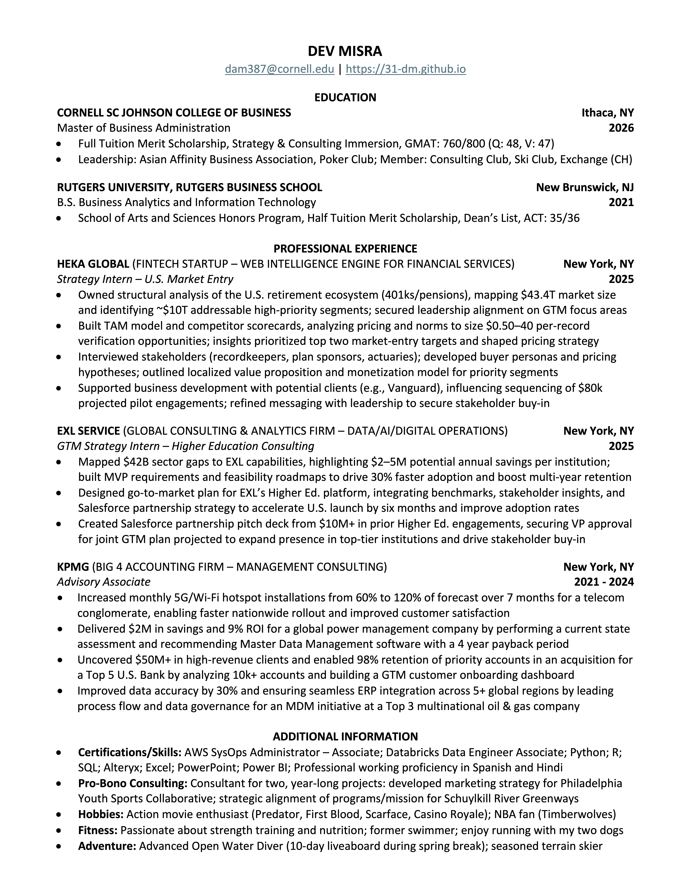

# Background

## About Me
MBA candidate at Cornell SC Johnson College of Business with a background in business analytics, strategy, and consulting. Leverage data-driven methodologies to drive decision-making, efficiency, and business transformation.  

Previously, I worked at KPMG as a consultant in their Digital Lighthouse group, where I led cross-functional initiatives in **strategy, transformation, post-merger integration, operations, and business process optimization** for clients in **telecom, finance, healthcare, energy, and more**. My expertise lies at the intersection of **data analytics, strategic problem-solving, and cross-functional collaboration**.  

## Areas of Expertise
- Business Strategy and Market Analysis
- Data Analytics, Predictive Modeling, and Process Automation
- Financial Modeling, Risk Analysis, and Decision Optimization
- Digital Transformation and Master Data Management (MDM)
- Enterprise Wide Integration (Post-Merger Integrations, Software Implementations)
- Cross-functional Collaboration and Stakeholder Management

---

## Resume  

  
<b>View Resume</b>

   

  

  | **Section** | **Details** |
  |------------|----------------------------------|
  | **Name** | Dev Misra |
  | **LinkedIn** | [linkedin.com/in/dev-misra](https://www.linkedin.com/in/dev-misra/) |
  | **Education** | Cornell SC Johnson College of Business (MBA '26), Rutgers Business School (B.S. '21) |
  | **Work Experience** | KPMG (Advisory Associate), Compass Pro Bono (Consultant) |
  | **Certifications** | AWS Certified Cloud Practitioner, AWS Certified SysOps Administrator - Associate, Databricks Certified Data Engineer Associate |
  | **Technical Skills** | Python, R, SQL, Alteryx, Power BI, Tableau, Excel, PowerPoint, Word |
  | **Portfolio** | [31-DM.github.io](https://31-dm.github.io/) |

  

  

    
  

