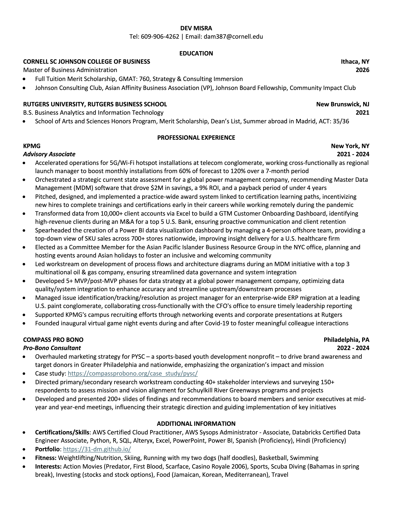

# Dev Misra  

## About Me
MBA candidate at Cornell SC Johnson College of Business with a background in business analytics, strategy, and technology consulting. I apply data-driven methodologies to drive decision-making, efficiency, and business transformation.  

Previously, I worked at KPMG as a consultant in their Digital Lighthouse group, where I led cross-functional initiatives in **tech strategy, digital transformation, post-merger integration, and business process optimization** for clients in **telecom, finance, healthcare, and energy**. My expertise lies at the intersection of **business analytics, technology integration, and strategic problem-solving**.  

## Areas of Expertise
- Business Strategy and Market Analysis  
- Data Analytics, Predictive Modeling, and Process Automation  
- Digital Transformation and Master Data Management (MDM)  
- Financial Modeling, Risk Analysis, and Decision Optimization  
- Technology Integration and Enterprise Software Implementation  

## Technical Skills
| **Category** | **Skills** |
|-------------|-----------|
| **Programming & Data Science** | Python, R, SQL, Alteryx |
| **Business Intelligence** | Power BI, Tableau, Excel, PowerPoint |
| **Cloud & Data Strategy** | AWS (Certified Cloud Practitioner, SysOps Administrator), Databricks |
| **Process Automation** | UI Scripting, Workflow Optimization, Digital Transformation |

---

## Resume  

  
<b>View Resume</b>

   

  

  | **Section** | **Details** |
  |------------|----------------------------------|
  | **Name** | Dev Misra |
  | **Tel** | 609-906-4262 |
  | **Email** | [dam387@cornell.edu](mailto:dam387@cornell.edu) |
  | **LinkedIn** | [linkedin.com/in/dev-misra](https://www.linkedin.com/in/dev-misra/) |
  | **Education** | Cornell SC Johnson College of Business (MBA '26), Rutgers Business School (B.S. '21) |
  | **Work Experience** | KPMG (Advisory Associate), Compass Pro Bono (Consultant) |
  | **Certifications** | AWS Certified Cloud Practitioner, AWS SysOps Administrator, Databricks Certified Data Engineer Associate |
  | **Technical Skills** | Python, R, SQL, Alteryx, Power BI, Tableau, Excel, PowerPoint, Word |
  | **Portfolio** | [31-DM.github.io](https://31-dm.github.io/) |

  

   

  

    
  

   

  

    [**Download Resume (PDF)**](assets/resume/DM_Resume.pdf)
  

